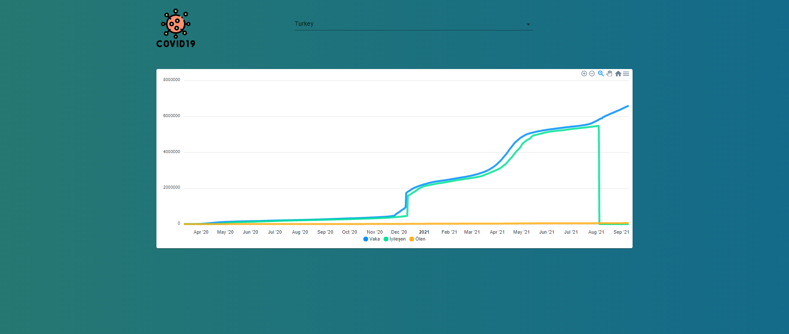

# React Js İle Covid19 Vakaları Tabolosu
Bu çalışmanın amacı React Hook kullanımı, state güncellemeleri,UseEffect kullanarak 
internetten verileri nasıl alacağımız öğrenmektir.

Search kısmından seçilen ülkenin Codiv Vakaları'nın talblosunun Api'den çekerek alıyoruz.

## Ekran Görüntüsü

